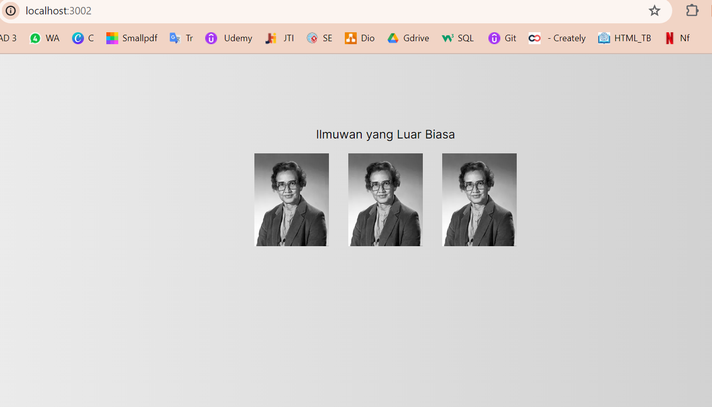
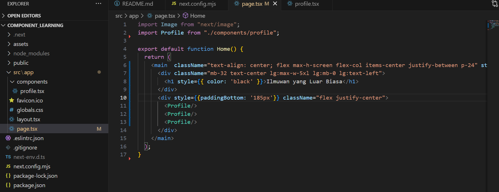
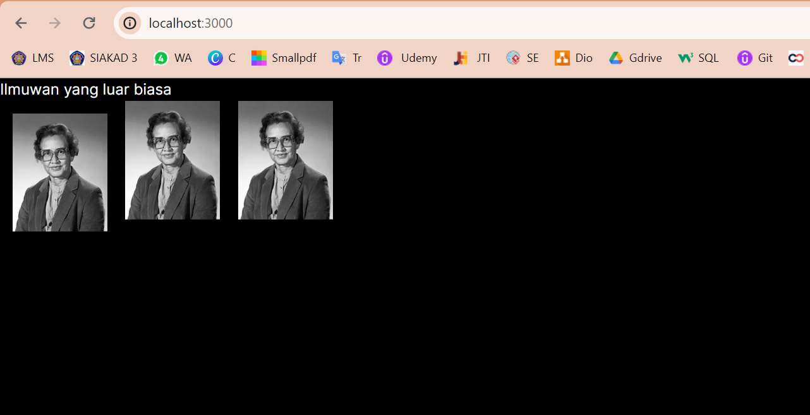

This is a [Next.js](https://nextjs.org/) project bootstrapped with [`create-next-app`](https://github.com/vercel/next.js/tree/canary/packages/create-next-app).

## Getting Started

First, run the development server:

```bash
npm run dev
# or
yarn dev
# or
pnpm dev
# or
bun dev
```
## Laporan Praktikum

|  | Pemrograman Berbasis Framework 2024 |
|--|--|
| NIM |  2141720269|
| Nama |  Muhammad Asad |
| Kelas | TI - 3I |


### Question 1
Change the contents of the code Home()so that it can appear as follows by utilizing the components Profile()that were created in step 1!




## Question 2
Capture the results and create a report in README.md . Explain what you have learned and how does it look now?




Contoh perubahan.