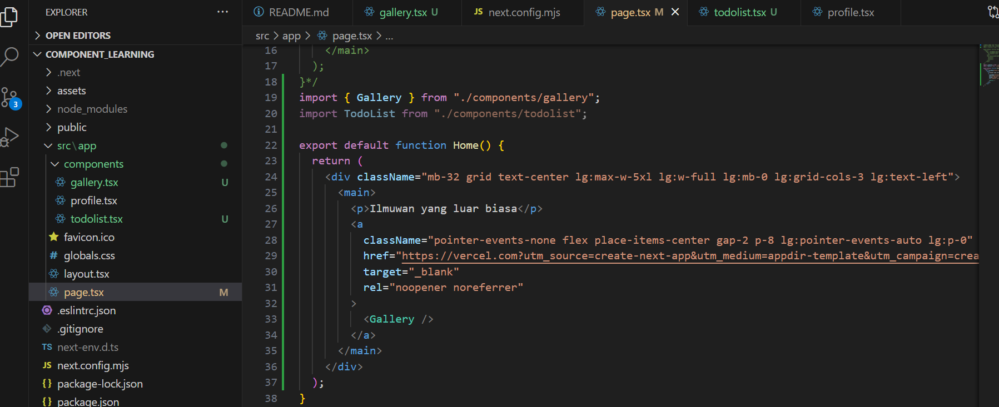

This is a [Next.js](https://nextjs.org/) project bootstrapped with [`create-next-app`](https://github.com/vercel/next.js/tree/canary/packages/create-next-app).

## Getting Started

First, run the development server:

```bash
npm run dev
# or
yarn dev
# or
pnpm dev
# or
bun dev
```
## Laporan Praktikum

|  | Pemrograman Berbasis Framework 2024 |
|--|--|
| NIM |  2141720269|
| Nama |  Muhammad Asad |
| Kelas | TI - 3I |


### Question 1
Change the contents of the code Home()so that it can appear as follows by utilizing the components Profile()that were created in step 1!


## Question 2
Capture the results and create a report in README.md . Explain what you have learned and how does it look now?




## Answer
I got that after making components i can use them anywhere anytime.
About the interface, it is slightly changed because the picture doesn't have 'div' like before.

## Question 3
Please correct the following JSX code. You may use a converter or repair it manually.


## Question 4
The code above still contains errors, please correct them.


## Question 5
Open the file src/components/todolist.tsxand extract the image URL into an object person.


## Question 6
Correct the code in the attributes section src. You can adjust other codes from the answers to the previous.
To check if your fix was successful, try changing the value from imageSizeto 'b'. Images should adjust to size after conversion.


Contoh perubahan.